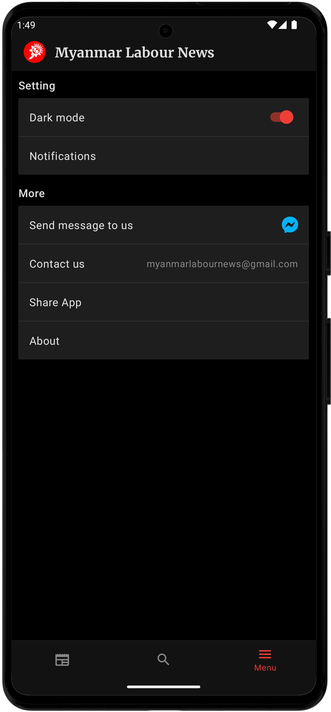

# Myanmar Labour News Blog Android

Myanmar Labour News Android app project completely rewritten in jetpack compose.

### Build and run

Required `local.properties`

```bash
apiUrl= # backend api url
oneSignalAppId= # one signal app id for push notification
```

> [!NOTE]
> You first need to `Build -> Rebuild Project` to generate BuildConfig 

### Screenshots

<div float="left">
   
   
   
</div>

<div float="left">
   
   
   
</div>